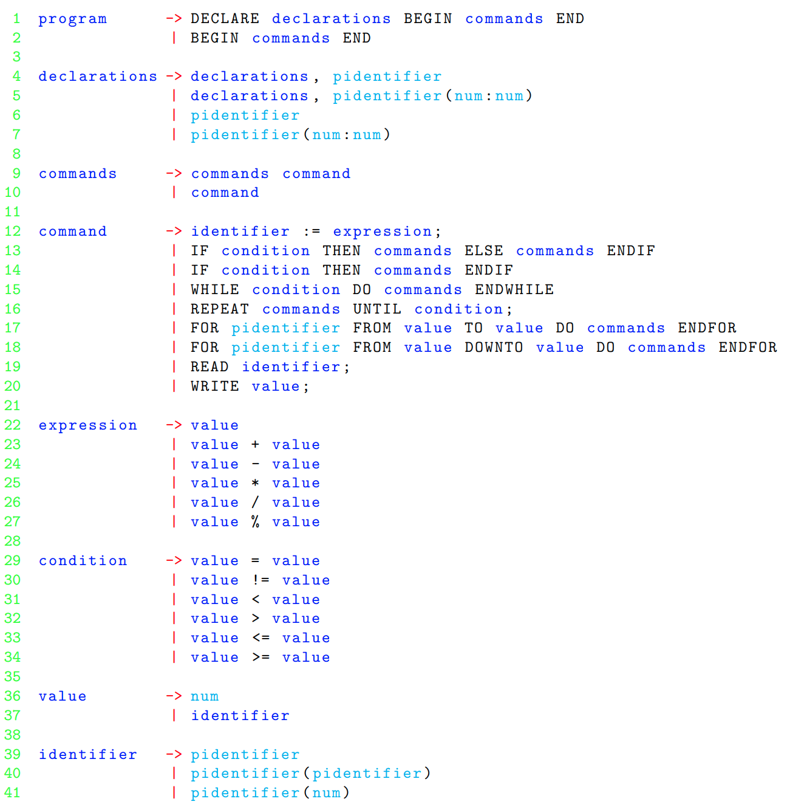

# Simple-Compiler
## Author of language rules and virtual machine called "maszyna_wirtualna" is PhD Maciej Gębala (Wrocław University of Technology).

## Task:
Implement compiler:
- check if input file grammatically and lexically fits in given language rules by PLY library (http://www.dabeaz.com/ply/)
- parse input file to machine code which will be executed on virtual machine (maszyna_wirtualna)

## Needed libraries:
- PLY (pip3 install PLY)

## Language rules:

## Important assumptions:
- arithmetic operators:
    - "**+**" -> addition
    - "**-**" -> substraction
    - "**\***" -> multiplication
    - "**/**" -> division
    - "**%**" -> modulo
- relations on natural numbers:
    - "**=**" -> equals
    - "**!=**" -> not equals
    - "**<**" -> lower than
    - "**>**" -> greather than
    - "**<=**" -> lower than / equals
    - "**>=**" -> greater than / equals
- only natural numbers: a-b = max{a-b, 0}
- divind/modulo by 0 gives 0
- defining symbol value -> **:=**
- declaring tab(10:100) allocates table "tab" with **91** fields indexed from **10** to **100**
- for-loop iterator:
    - cannot be modified inside loop
    - is named differently than global variable names and iterators from nested loops
- comment:
    - starts with "**[**" and ends with "**]**"
    - cannot be nested
- **pidentifier** is a regular expression [_a-zA-Z]+ (name of variable)
- symbol "**;**" ends line of code

## Example input file with an appropriate code:
#Author: PhD Maciej Gębala  
[ sort generated table ]  
DECLARE  
&emsp; &emsp; tab(1:22), x, q, w, j, k, n, m  
BEGIN  
&emsp; &emsp; n := 23;  
&emsp; &emsp; m := n - 1;  
&emsp; &emsp; q := 5;  
&emsp; &emsp; w := 1;  
&emsp; &emsp; [ tab generation ]   
&emsp; &emsp; FOR i FROM 1 TO m DO  
&emsp; &emsp; &emsp; &emsp; w := w * q;  
&emsp; &emsp; &emsp; &emsp; w := w % n;  
&emsp; &emsp; &emsp; &emsp; tab(i) := w;  
&emsp; &emsp; ENDFOR  
&emsp; &emsp; [ print tab ]  
&emsp; &emsp; FOR i FROM 1 TO m DO  
&emsp; &emsp; &emsp; &emsp; WRITE tab(i);  
&emsp; &emsp; ENDFOR  
&emsp; &emsp; WRITE 1234567890;  
&emsp; &emsp; [ sorting ]  
&emsp; &emsp; FOR i FROM 2 TO m DO  
&emsp; &emsp; &emsp; &emsp; x := tab(i);  
&emsp; &emsp; &emsp; &emsp; j := i;  
&emsp; &emsp; &emsp; &emsp; WHILE j > 1 DO  
&emsp; &emsp; &emsp; &emsp; &emsp; &emsp; k := j - 1;  
&emsp; &emsp; &emsp; &emsp; &emsp; &emsp; IF tab(k) > x THEN  
&emsp; &emsp; &emsp; &emsp; &emsp; &emsp; &emsp; &emsp; tab(j) := tab(k);  
&emsp; &emsp; &emsp; &emsp; &emsp; &emsp; &emsp; &emsp; j := j - 1;  
&emsp; &emsp; &emsp; &emsp; &emsp; &emsp; ELSE  
&emsp; &emsp; &emsp; &emsp; &emsp; &emsp; &emsp; &emsp; k := j;  
&emsp; &emsp; &emsp; &emsp; &emsp; &emsp; &emsp; &emsp; j := 0;  
&emsp; &emsp; &emsp; &emsp; &emsp; &emsp; ENDIF  
&emsp; &emsp; &emsp; &emsp; ENDWHILE  
&emsp; &emsp; &emsp; &emsp; tab(k) := x;  
&emsp; &emsp; ENDFOR  
&emsp; &emsp; [ print sorted tab ]  
&emsp; &emsp; FOR i FROM 1 TO m DO  
&emsp; &emsp; &emsp; &emsp; WRITE tab(i);  
&emsp; &emsp; ENDFOR  
END  

